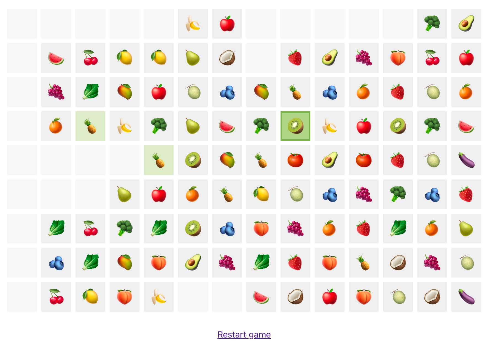

# Kris Mahjong

**Project for Experts Systems course at AGH.**

**Solver written in Prolog and UI in React.**

---

## Architecture

1. Game rules and hints are implemented in Prolog. It runs HTTP server and exposes simple stateless JSON-based API.

2. UI is implemented in React. It runs in browser. It manages game state and uses the above API to validate possible moves and display hints.

## Running

Execute `docker-compose up --build` and open http://localhost:3000/
